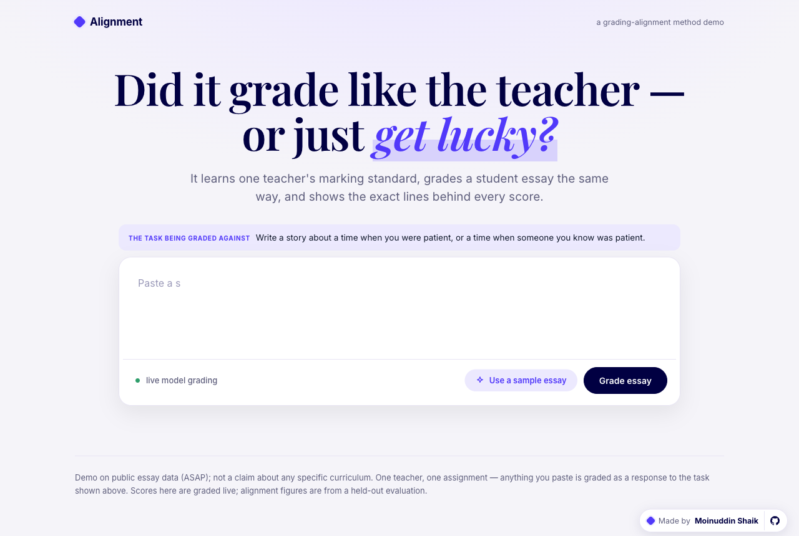
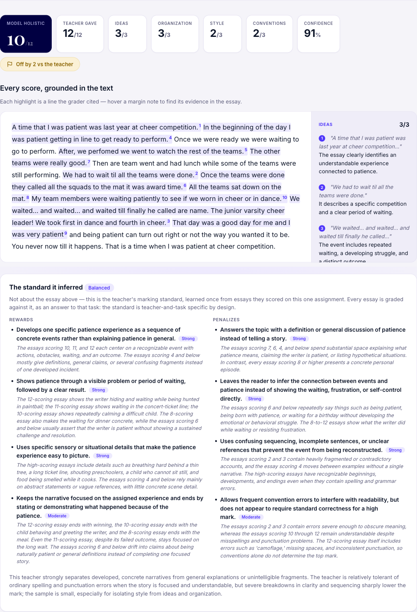
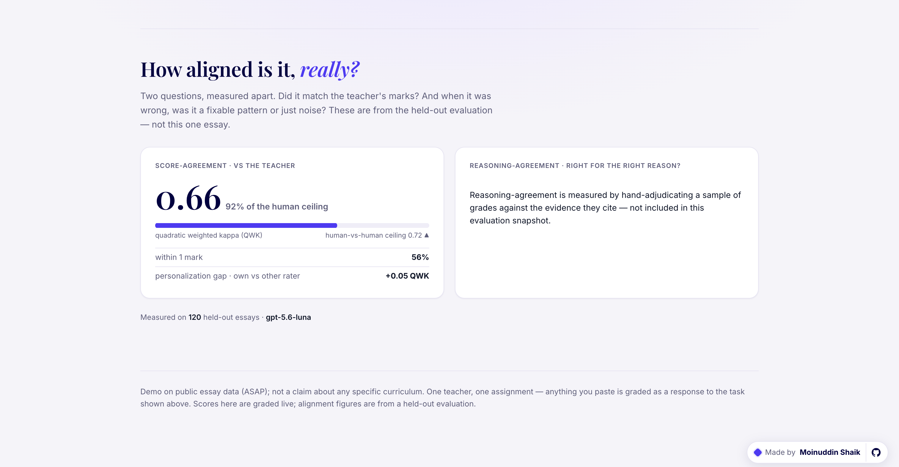

# Alignment — measuring whether an AI grader agrees for the *right reason*

[](https://markalign.up.railway.app) [-010042)](results/)

Real ASAP essays pre-graded against a learned teacher standard; paste any essay on the live demo to grade it live.



The hard problem in AI assessment isn't producing a score. Anything can output a number. The hard problem is telling a grader that works from one that merely looks like it works: did it match the teacher for the right reason, or did it get lucky? That's the risk for anyone putting AI in front of student work, and it's what this system measures.

There is a grader in here, but it exists so the measurement has something real to measure. It learns one teacher's marking standard, grades a new essay, and shows the exact spans behind every score. The measurement itself is the deliverable:

- **Score-agreement** — did it match the teacher's held-out marks? (QWK)
- **Reasoning-agreement** — when the score was right, was it right for the right reason? And when it was wrong, was the error a fixable systematic pattern or just noise?

Separating those two questions, and separating systematic bias from random noise inside the second one, is the judgment the rest of this repo is built to make legible.


*A real seventh-grader's essay, graded blind. The model gave 10/12; the teacher gave 12/12. Every score points at exact lines in the text, and the learned standard below it is readable: what this teacher rewards and penalizes, with evidence and strength.*

> **Current scope, stated up front:** this demonstrates grader-profile learning and diagnosis on held-out essays *from the same assignment*. ASAP has no persistent grader identities across tasks, so cross-task teacher transfer cannot be established here. The set-1 experiment below tests transfer of the evaluation methodology, not of a teacher profile. Separating "learned the teacher" from "learned the task" needs the same identified grader on two assignments (see Honest limits).

> Stack mirrors a typical AI-native assessment backend: Python + FastAPI, Pydantic-typed contracts, a model adapter, and a model-free eval harness.

**Jump to:** [Run it](#run-it-in-30-seconds-no-api-key) · [The eval](#the-eval-where-the-judgment-shows) · [Results](#results-real-on-asap-set-7) · [Generalization](#does-it-generalize-asap-set-1--different-genre-scale-and-raters) · [Architecture](#architecture) · [Honest limits](#honest-limits-read-before-believing-any-number)

---

## Run it in 30 seconds (no API key)

```bash
pip install -r requirements.txt
EDEXIA_MOCK=1 uvicorn backend.app:app --reload
# open http://localhost:8000
```

Mock mode uses a deterministic fake grader so the whole thing runs with no key. It carries a deliberate bias (harsh on short essays) so the eval has a real systematic error to catch. Grade the sample essay, then shorten it and watch the score drop and the confidence gate abstain.

### Grade for real

```bash
export ANTHROPIC_API_KEY=sk-...
uvicorn backend.app:app --reload          # EDEXIA_MOCK unset → real grading
```

---

## The eval (where the judgment shows)

```bash
# prove the pipeline, no key (deterministic fake grader)
python -m eval.run_eval --mock --data data/asap_set7_sample.json --rubric data/asap_set7_rubric.json

# real numbers on real ASAP set 7 (needs a model key in .env; --max-test caps cost)
# --checklist = the headline config: teacher-derived yes/no ladders, score = count of yeses
python -m eval.run_eval --data data/asap_set7_essays.json --rubric data/asap_set7_rubric.json \
                        --calib 25 --max-test 120 --checklist

python -m eval.run_eval --mock --adjudicate 40   # + reasoning taxonomy (method demo)
```

It reports three things, each mapped to a claim:

| Claim | How it's checked | Metric |
|---|---|---|
| Grades like the teacher | vs held-out human marks | **QWK** (the ASAP standard) |
| Personalizes to a grader | fit own rater vs the *other* rater | QWK gap |
| Right for the right reason | sampled hand/model adjudication | reasoning taxonomy *(method, not yet a result)* |

The reasoning taxonomy splits wrong grades into systematic (a fixable pattern, e.g. length bias) and random (the ceiling).

---

## Results (real, on ASAP set 7)



120 held-out essays, a 25-essay calibration set, per grader model. Read every number against the human ceiling, not against 1.0: two trained raters on this set agree at QWK 0.72, and that's the bar a grader is measured against.

| grader model · prompt format | QWK vs the teacher | within 1 mark | mean error (0–12) |
|---|---|---|---|
| `claude-sonnet-4-5` · direct rating | 0.40 | 29% | 2.9 pts |
| `gpt-5.6-luna` · direct rating | 0.585 | 55% | 1.3 pts |
| `gpt-5.6-luna` · checklist | 0.656 | 41% | 2.0 pts |
| **`gpt-5.6-luna` · checklist + score-distribution floor** | **0.664** | **56%** | 1.66 pts |
| human vs human (ceiling) | 0.72 | — | — |

The best configuration reaches **92% of the human-vs-human ceiling** on this hard 13-level scale, learning the teacher from 25 essays with no fine-tuning. One held-out split of 120 essays, so read it as a strong single run rather than a cross-validated mean.

Two different things move this table. The model swap (rows 1→2, same prompt) closed most of the gap: sonnet ranked essays fine but scored them on a systematically shifted scale, diagnosed below. The prompt-format changes (rows 2→4, same model) closed the rest, and each one was a measured fix:

- **Checklist grading** (row 3) came from the scoring-bias literature. LLM judges are unstable on ordinal scales but steady on binary decisions, so instead of "rate ideas 0–3", the profile builder learns a per-trait ladder of yes/no questions from the teacher's own examples. The score is the count of passed bars, each bar pinned to a verbatim quote. QWK jumped because the grader finally uses the whole scale the way the teacher does. But its worst misses got worse (within-1 fell to 41%): the ladders had no floor, so weak essays took 0s a real teacher never gives.
- **The score-distribution floor** (row 4) fixed that with data. Code counts how the teacher actually uses each trait's scale over the calibration essays (this teacher gives organization a 0 on about 0.6% of essays; ideas, about 9%) and puts the counts in the prompt with one conditional instruction: if the teacher never uses the bottom score, the ladder's first rung must be a bar nearly every essay clears. Counting is code's job. Noticing a distribution across 25 essays is exactly what an LLM quietly fails at. And the fix is per-grader: a genuinely harsh teacher's counts would keep the ladder strict. Every metric moved the right way at once, which dissolved the row-3 tradeoff.

The number still isn't the point; the eval's diagnosis is. Two things the same harness surfaced that a bare QWK would hide:

1. **The weak model wasn't broken, it was miscalibrated.** Its mean score rises monotonically with the human's, so it ranks essays correctly, but it runs harsh and compressed. That error is systematic. A scale transform fit on the calibration set recovers it: 0.40 → 0.47, mean error 2.9 → 1.7.
2. **Applied blindly, calibration hurts.** The same transform on the already-well-calibrated strong model made it worse (0.585 → 0.478) by over-compressing a grader that already had the right spread. So calibration is gated on the diagnosis: systematic offset, calibrate; healthy spread, leave it alone. Knowing when *not* to calibrate is the point.

**Personalization:** own-rater vs other-rater gap +0.03. Small by construction, since the two raters share a rubric, and that's the honest expected result.

### Does it generalize? (ASAP set 1 — different genre, scale, and raters)

To check whether the recipe was quietly overfit to set 7's quirks, the identical pipeline ran on set 1: persuasive letters instead of stories, a 1–6 holistic that is not a trait sum, no trait ground truth, and a different pair of human raters (who agree with each other at QWK 0.721, coincidentally the same ceiling as set 7).

| set 1, 120 held-out essays | QWK | % of ceiling | mean error (1–6) |
|---|---|---|---|
| raw | 0.369 | 51% | 1.13 |
| **calibrated** | **0.576** | **80%** | **0.47** |

The raw number dropped, and that's the interesting part. The diagnosis showed the same signature as sonnet-on-set-7, mirrored: the model ranks set-1 essays correctly (its mean rises with the human score at every level) but runs generous and compressed, handing out 5s and 6s to 109 of 120 essays where the humans center on 4. By this eval's own rule that is the calibrate case, and the prediction was stated before running the fix. It held. QWK 0.369 → 0.576, mean error halved, fitted only on the 25 calibration essays.

That makes the calibrate/don't-calibrate rule three for three, with the third call made in advance on a task type it had never seen:

| case | diagnosis | rule said | outcome |
|---|---|---|---|
| sonnet · set 7 | harsh, monotonic | calibrate | 0.40 → 0.47 ✓ |
| luna · set 7 | already well-spread | don't | confirmed — it *hurt* (0.585 → 0.478) ✓ |
| luna · set 1 | generous, monotonic | calibrate | **0.369 → 0.576** ✓ (predicted first) |

Read honestly: the grader is strong on set 7 (92% of ceiling) and decent-after-calibration on set 1 (80%). Transfer is real but it isn't free. What generalized cleanly is the measurement: on new data the eval identified why the grader was off and prescribed the fix that worked.

> Why it matters here: moving beyond standardised senior English into per-department, Years 7–10 assessment means learning each grader's standard from a handful of examples, and expanding without losing trust. This measures exactly that: can it learn one grader's standard, tell when it's off and why, and know which fix actually helps.

---

## Architecture

```
ingestion → normalized store
          → profile builder (per grader, cached)  ─┐
                                                    ▼
   essay + rubric ─────────────► grading engine → GradingResult (typed, span-grounded)
                                                    │
                                          abstention gate
                                     ┌──────────────┴──────────────┐
                                     ▼                             ▼
                              served result                  eval harness
                                                        (QWK · calibration ·
                                                         reasoning taxonomy)
```

Three seams carry the design:

- **Profile is a cacheable artifact**, not a runtime step, so personalization can be ablated by swapping one input (own profile / none / the wrong grader's).
- **`GradingResult` is the contract.** Span-grounding and confidence are schema validation rather than prose you hoped for; an ungrounded trait score fails to construct.
- **The metrics layer is model-free** (except sampled adjudication), so it's reproducible over frozen results, and score-agreement never gets entangled with reasoning-agreement.

```
backend/   schemas · model_adapter · profile_builder · grading_engine · abstention · app
eval/      dataset · metrics · reasoning · run_eval
data/      convert_asap.py · real ASAP set 7 (two raters, real traits) + synthetic fallback
frontend/  single dependency-free HTML file (served by the API)
```

**On the frontend stack:** it's a single dependency-free HTML file on purpose, so the demo runs as one FastAPI service with no build step and no second deploy target. Production would be Next.js + TypeScript + Tailwind to match your stack. That's overhead a one-service demo doesn't need, and the `/grade` JSON contract is the clean seam to swap it later.

---

## Real ASAP-AES data (wired, not hypothetical)

`data/convert_asap.py` converts the public ASAP-AES benchmark into the records shape the eval expects (`essay_id, text, rater1_holistic, rater2_holistic, rater1_traits, rater2_traits`):

```bash
python data/convert_asap.py training_set_rel3.tsv --set 7
python -m eval.run_eval --data data/asap_set7_essays.json \
                        --rubric data/asap_set7_rubric.json --calib 25 --max-test 120
```

Set 7 is used because its per-rater holistic (0–12) is exactly the sum of four real per-rater trait scores (ideas / organization / style / conventions), so the two-rater personalization split and real trait ground truth both come through. The two pre-resolution raters become two "graders": a real personalization test with no new annotation. Human inter-rater agreement on this set is QWK ≈ 0.72, and that's the ceiling any grader is measured against.

The dataset is Kaggle-gated, so `training_set_rel3.tsv` isn't committed; a small converted sample is checked in so the pipeline is provably real offline.

---

## Honest limits (read before believing any number)

- **Real ASAP ≠ your distribution.** Score-agreement numbers are real (ASAP set 7, held-out marks), but ASAP isn't VCE/HSC/IB. The claim is that the method transfers, never that it works on a specific curriculum's distribution. Read the human ceiling with it: two trained raters agree at QWK ≈ 0.72, so a grader is measured against 0.72, not 1.0.
- **The two raters share a rubric**, so the personalization gap is small by construction. A small effect is the expected, honest result here; a large one would be suspicious.
- **Confidence is anti-calibrated, so the abstention gate is currently useless.** On the real run the model never reported confidence below the 0.6 threshold (0/120 abstentions), and its more-confident grades were worse: mean absolute error 3.13 in the 0.8–1.0 band vs 2.25 in the 0.6–0.8 band. The gate works. The signal driving it does not. Calibrating confidence, not just scores, is the next piece of work.
- **Calibration is not a universal booster.** On the already-well-calibrated stronger grader the same scale transform reduced agreement (QWK 0.585 → 0.478). It only helps a model with a systematic offset, so it's gated on the eval's systematic-vs-spread diagnosis instead of applied by default (see Results).
- **The profile learns teacher-and-task together, not the teacher alone.** All 25 calibration essays answer one assignment, so the learned standard entangles the grader's taste (severity, floors, what they reward) with the task's requirements (must be a story about patience). Parts of the profile are plausibly teacher-general and parts are task-specific, but proving that a teacher's standard transfers across tasks needs the same identified grader on two different assignments, which ASAP doesn't have — "rater1" is a column, not a person. The set-1 run tests method generality, not teacher transfer.
- **Reasoning-agreement is a method, not a validated result.** There is no reasoning ground truth in ASAP, so the taxonomy rests on hand-adjudication against documented labelling criteria; its credibility is in those criteria rather than in a number. Score-agreement is the number you can trust. Reasoning-agreement is the framework for the harder question.

---

## Deploy (one service, one link)

Render: push to GitHub, "New Web Service", point at the repo. `render.yaml` is included; it starts in mock mode so the link is live immediately. Add `ANTHROPIC_API_KEY` and set `EDEXIA_MOCK=0` to grade for real.

Optionally, set `SUPABASE_URL` and `SUPABASE_ANON_KEY` (a Supabase project with the Google provider enabled) to put live paste-grading behind Google sign-in with per-user rate limits — the preloaded samples stay public either way. Leave them unset and the gate is simply off.

Or anywhere that runs a Procfile: `uvicorn backend.app:app --host 0.0.0.0 --port $PORT`.
